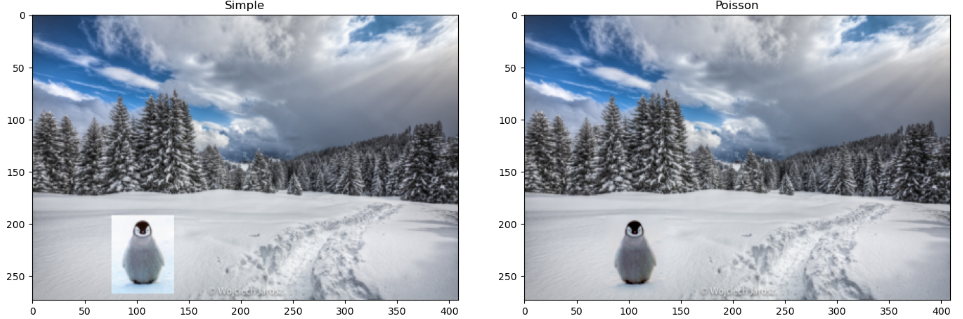

# Gradient-Domain Copy and Paste

## Overview

This project implements a gradient-domain copy-paste system for blending two images seamlessly. The system utilizes a least-squares optimization approach to minimize the intensity difference between pixels at the boundary of the source and target images, ensuring a smooth transition. By solving for the optimal pixel values using a sparse matrix representation, the algorithm produces results that blend seamlessly into the background.

---

## Key Features

### Least-Squares Optimization (`least_squares_2D`):

- Solves for pixel values that minimize the intensity differences between neighboring pixels in the source and target regions.

- Employs sparse matrix representation for efficient storage and computation, particularly for large images.

- Utilizes the LSQR algorithm from the `scipy.sparse.linalg` library to solve the sparse linear system.

### User Interface

  - Allows users to select a region on the background image where the object image will be blended.

  - Poisson Blending (`poisson_copy_paste`): Computes the blended image using gradient-domain optimization, ensuring smooth transitions. Displays this image to the user along with the simple copy-paste alternative.

---

## How It Works

1. **Input Preparation**:

   - Reads and resizes the background and source images for computation.
   - Allows users to select a region on the background image for blending.

2. **Least-Squares Optimization**:

   - Constructs a sparse matrix representing the desired constraints between pixel intensities.
   - Solves the system using the LSQR algorithm to compute the best-fit pixel values.

3. **Visualization**:

   - Displays side-by-side comparisons of simple copy-paste and Poisson blending to highlight the benefits of gradient-domain optimization.

---

## Environment Setup

To ensure proper execution of the code, use the provided `.yml` file in the repository to set up the required environment. This file includes all necessary dependencies and configurations for running the project smoothly.

---

## Acknowledgments

This project was developed as part of the Dartmouth CS70 curriculum, Fall 2024.

---

## Try it out!

---

## License

This project is distributed under the MIT License. Refer to the LICENSE file for detailed terms and conditions.

